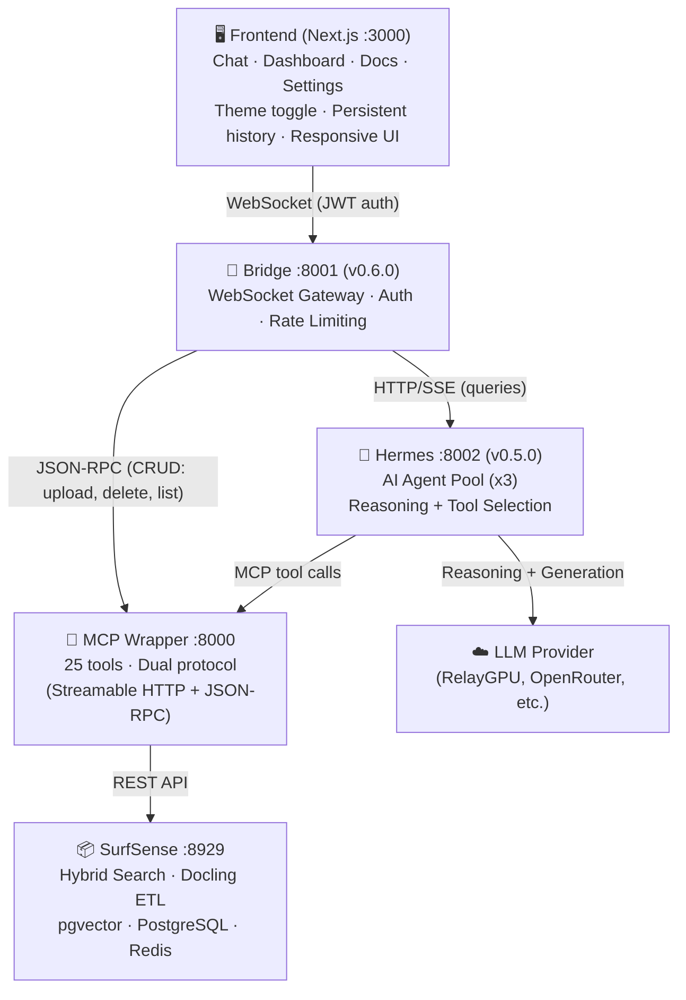

# Architecture

> Last updated: 2026-03-30 (v0.6.0)

## What DocuMentor is

DocuMentor is an **intelligent document analysis platform** for universities that connects:

1. **SurfSense** — document ingestion, chunking, embedding, hybrid search
2. **Hermes Agent** — AI reasoning with tool-use capabilities (dedicated container, pooled)
3. **MCP Wrapper** — 25 tools exposing SurfSense as MCP protocol
4. **Bridge** — WebSocket gateway with auth, streaming, and conversation management
5. **Dashboard** — Next.js web UI with real-time chat, visualizations, and document management

DocuMentor does **not** implement its own:
- Document parsing (→ SurfSense + Docling)
- Vector search or RAG (→ SurfSense + pgvector)
- LLM inference (→ RelayGPU, OpenRouter, or any OpenAI-compatible provider)
- Agent orchestration (→ Hermes Agent AIAgent)

## System diagram



**Key data flows:**
- **Hermes → LLM Provider**: Reasoning, response generation, tool-call decisions
- **Hermes → MCP Wrapper**: Tool calls to search/query documents
- **Bridge → MCP Wrapper**: Direct CRUD operations (no LLM needed)
- **MCP Wrapper → SurfSense**: Document search, upload, indexing, extraction
- SurfSense does **not** call the LLM — it handles RAG (search + embeddings) only

## How queries flow (v0.6.0)

```
1. User types question in chat
2. Frontend sends: { type: "query", payload: { query, search_space_id } }
3. Bridge checks Hermes availability (GET /health)
4. If Hermes available:
   a. Bridge POSTs query + conversation history to Hermes (/query)
   b. Hermes leases an agent from the pool (async, non-blocking)
   c. Agent reasons about the query, decides which tools to call
   d. Agent calls LLM Provider for reasoning/generation
   e. Agent calls MCP Wrapper tools for document search/retrieval
   f. Hermes streams SSE events back to Bridge:
      - event: delta → { type: "stream", delta: "..." }
      - event: tool  → { type: "agent_status", tool: "..." }
      - event: done  → { type: "result", dashboard: {...} }
   g. Agent returned to pool after completion
   h. Bridge stores updated conversation history
5. If Hermes unavailable (fallback):
   a. Bridge calls MCP wrapper directly via JSON-RPC (surfsense_query)
   b. Returns result without AI reasoning
6. Frontend renders streamed text + dashboard visualizations
7. Chat history persisted to localStorage
```

## How uploads flow

```
1. User drops file in UI
2. Frontend encodes as base64, sends: { type: "upload", payload: {...} }
3. Bridge validates (Pydantic: filename, size ≤50MB, search_space_id)
4. Bridge decodes base64 → temp file, frees b64 from memory
5. Bridge calls MCP wrapper: surfsense_upload(file_path, search_space_id)
6. MCP wrapper POSTs multipart to SurfSense /api/v1/documents/fileupload
7. SurfSense queues document (Docling ETL → chunks → embeddings)
8. Bridge polls surfsense_document_status every 2s (max 60s)
9. Once ready, Bridge calls surfsense_extract_tables
10. Bridge sends dashboard JSON to frontend
11. Frontend renders via DashboardRenderer + toast notification
```

## Authentication flow (v0.6.0)

```
1. User visits DocuMentor → /auth/check (cookie-based)
2. If unauthenticated → Login screen (email + password)
3. POST /auth/login → validates against DOCUMENTER_EMAIL/PASSWORD (.env)
4. Returns JWT token (HMAC-SHA256, 24h TTL)
   - Set as httpOnly cookie (primary auth)
   - Stored in sessionStorage (WebSocket fallback)
5. WebSocket connects with token (cookie or ?token= query param)
6. Bridge validates JWT on handshake, rejects 4001 if invalid
7. DOCUMENTER_AUTH=false disables auth entirely (dev mode)
```

## Docker services

| Service | Port | Container | Role |
|---|---|---|---|
| **bridge** | 8001 | `Dockerfile.bridge` | WebSocket gateway, auth, query routing |
| **hermes** | 8002 | `hermes-service/Dockerfile` | AI reasoning, agent pool, MCP tool use |
| **mcp-wrapper** | 8000 | `Dockerfile.mcp` | 25 MCP tools over SurfSense |
| **surfsense-backend** | 8929 | (from SurfSense) | RAG, search, doc processing |
| **postgres** | 5432 | (from SurfSense) | Data + pgvector |
| **redis** | 6379 | (from SurfSense) | Task queue |

## What is DocuMentor's own code vs. dependencies

| Component | Owner | Location |
|---|---|---|
| Bridge server (v0.6.0) | **DocuMentor** | `backend/bridge.py` |
| Auth module | **DocuMentor** | `backend/auth.py` |
| Hermes HTTP wrapper (v0.5.0) | **DocuMentor** | `hermes-service/server.py` |
| MCP wrapper (v1.0.0) | **DocuMentor** | `surfsense-skill/mcp_server.py` |
| Frontend UI | **DocuMentor** | `frontend/` |
| Dashboard schemas | **DocuMentor** | `DOCSTEMPLATES.md` |
| Docker composition | **DocuMentor** | `docker-compose.yml` |
| SurfSense | MODSetter | SurfSense Docker image |
| Hermes Agent | Nous Research | `hermes-agent/` (submodule) |
| surfsense-skill | **DocuMentor** | `surfsense-skill/` (submodule, own repo) |

## Known limitations

1. **LLM dependency for structured output**: Dashboard quality depends on
   the model's ability to return valid JSON. The frontend handles malformed
   data gracefully with fallback rendering.

2. **Single-user design**: One installation = one user. Auth is access
   control (email/password from .env), not multi-tenancy.

3. **Base64 uploads**: Files are encoded in-browser. The bridge enforces 50MB
   and frees memory after decode, but large files spike RAM temporarily.

4. **No offline processing**: All queries require a live LLM provider.

5. **SurfSense API contract**: The MCP wrapper assumes specific API shapes.
   The submodule is pinned to a specific commit to mitigate breakage.

## Security model

- **Authentication**: JWT tokens (HMAC-SHA256), httpOnly cookies, 24h TTL.
  WebSocket handshake validates token. Configurable via `DOCUMENTER_AUTH`.
- **Network boundary**: All services on localhost / Docker internal network.
  Exposed ports: frontend (:3000), bridge WebSocket (:8001).
- **CORS**: Restricted to configured origins (default: localhost:3000).
- **Rate limiting**: 30 requests per 60s per WebSocket connection.
- **No generic passthrough**: 11 typed handlers, each Pydantic-validated.
- **Upload validation**: Filename sanitized, size enforced, temp files cleaned
  on startup and after each upload.
- **Preflight checks**: Bridge validates env vars, auth config, upload dir
  writability, and service URLs at startup.
- **Hermes isolation**: `skip_context_files=True`, `skip_memory=True` —
  no personal context leaks into document queries.
- **Inter-service**: Bridge ↔ Hermes ↔ MCP Wrapper communicate over Docker
  internal network. Only bridge exposes a port to the host.

## File structure

```
DocuMentor/
├── backend/
│   ├── bridge.py              ← WebSocket gateway + auth + Hermes client
│   ├── auth.py                ← JWT auth (zero external deps)
│   ├── Dockerfile.bridge
│   ├── Dockerfile.mcp
│   └── requirements.txt
├── hermes-service/
│   ├── server.py              ← HTTP/SSE wrapper, agent pool
│   ├── Dockerfile
│   ├── hermes-config.yaml     ← MCP config (Docker internal URLs)
│   └── requirements.txt
├── frontend/
│   ├── app/
│   │   ├── page.tsx           ← Main page (auth gate, routing, wiring)
│   │   ├── layout.tsx         ← Root layout (ThemeProvider, Toaster)
│   │   └── globals.css        ← shadcn CSS variables (oklch)
│   ├── components/
│   │   ├── ui/                ← shadcn components (CLI-managed)
│   │   ├── AppHeader.tsx      ← Header + tabs + connection banner
│   │   ├── ChatPanel.tsx      ← Chat with streaming, retry, copy
│   │   ├── DocSidebar.tsx     ← Documents + search + skeletons
│   │   ├── LoginForm.tsx      ← Auth login screen
│   │   ├── ErrorBoundary.tsx  ← React error boundary
│   │   ├── SettingsPanel.tsx  ← Settings + system info + theme
│   │   └── UploadModal.tsx
│   ├── hooks/
│   │   ├── useAuth.ts         ← Auth state + login/logout
│   │   ├── useBridge.ts       ← WebSocket client (auth-aware)
│   │   ├── useChatState.ts    ← Chat + localStorage persistence
│   │   ├── useDashboardState.ts
│   │   ├── useDocumentsState.ts
│   │   └── useUploadState.ts
│   ├── types/bridge.ts        ← Protocol types (discriminated unions)
│   ├── DashboardRenderer.tsx  ← JSON → visual dashboard
│   └── components.json        ← shadcn CLI config
├── surfsense-skill/           ← MCP server (own repo, submodule)
│   └── mcp_server.py         ← 25 tools, dual protocol
├── hermes-agent/              ← AI agent source (submodule)
├── docs/                      ← Audit reports, improvement plans
├── docker-compose.yml
├── setup.sh                   ← Interactive first-time setup
├── .env.example
├── ARCHITECTURE.md            ← This file
├── DEVELOPMENT_PLAN.md        ← Phased roadmap
├── DOCSTEMPLATES.md           ← Dashboard JSON schemas
└── README.md
```
