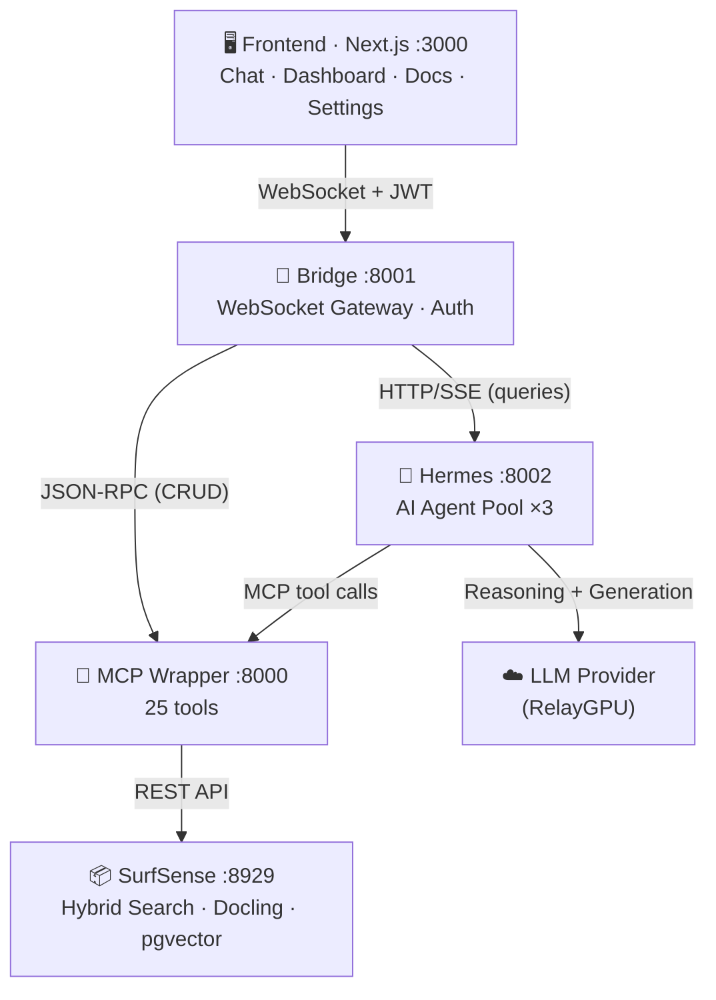

<p align="center">
  <h1 align="center">📚 DocuMentor</h1>
  <p align="center">
    <strong>Intelligent document analysis platform for universities</strong>
  </p>
  <p align="center">
    <a href="#quick-start">Quick Start</a> · <a href="#architecture">Architecture</a> · <a href="#hermes-integration">Hermes Integration</a> · <a href="ARCHITECTURE.md">Full Architecture Docs</a>
  </p>
  <p align="center">
    
    
    
    
    
  </p>
</p>

---

Upload documents. Ask questions in natural language. Get visual dashboards.
Self-hosted — your documents stay on your machine.

Built on [SurfSense](https://github.com/MODSetter/SurfSense) · [Hermes Agent](https://github.com/NousResearch/hermes-agent) · [RelayGPU](https://relay.opengpu.network)

---

## What is DocuMentor?

DocuMentor is a self-hosted document intelligence platform built for universities. It combines document parsing, RAG-powered search, and LLM inference into a single web interface with interactive dashboards.

**What it does:**
- Processes PDFs, spreadsheets, Word docs, PowerPoint, and more — extracting tables, metrics, and summaries
- Renders extracted data as interactive charts (bar, line, area, pie, KPIs)
- Lets you query documents in natural language with source-backed answers
- Routes queries through [Hermes Agent](https://github.com/NousResearch/hermes-agent) for intelligent reasoning and multi-step tool use
- Single-user JWT authentication with login screen

**What it doesn't do (yet):**
- Multi-user / RBAC — single-user auth (one install per user)
- Offline queries — requires a live LLM provider
- Automated tests / CI — planned

> DocuMentor orchestrates existing open-source tools (SurfSense for RAG, Docling for parsing, pgvector for search). Its value is the unified UI, the MCP tool layer, the bridge server, and the guided setup. See [ARCHITECTURE.md](ARCHITECTURE.md) for the full picture.

---

## Architecture



**Data flow summary:**
- **Queries** go through Hermes (:8002) for AI reasoning → calls LLM for generation + MCP tools for document retrieval
- **CRUD operations** (upload, delete, list) go directly from Bridge to MCP — no AI overhead
- **SurfSense** handles only RAG (search, indexing, embeddings) — it does **not** call the LLM
- **Document parsing** runs locally via Docling inside Docker
- **Embeddings** generated locally with `sentence-transformers/all-MiniLM-L6-v2`

---

## Quick Start

### Prerequisites

| Tool | Version | Notes |
|------|---------|-------|
| [Docker](https://www.docker.com/products/docker-desktop/) | 20.10+ | Docker Compose v2 included |
| [Node.js](https://nodejs.org/) | 18+ | For the dashboard |
| [Git](https://git-scm.com/) | any | Submodule support required |
| [Python](https://www.python.org/) | 3.11+ | For Hermes Agent (optional) |
| Disk space | ~5 GB | Docker images + dependencies |
| LLM API key | — | [RelayGPU](https://relay.opengpu.network) recommended |

### Step by step

```bash
# 1. Clone with submodules
git clone --recursive https://github.com/Asphyksia/DocuMentor
cd DocuMentor

# 2. Option A: Interactive setup (recommended)
./setup.sh

# 2. Option B: Manual setup
cp .env.example .env
# Edit .env — fill in OPENAI_API_KEY, SECRET_KEY, SURFSENSE_PASSWORD, DOCUMENTER_PASSWORD

# 3. Start backend services
docker compose up -d

# 4. Start the dashboard
cd frontend
npm install
npm run dev

# 5. Open http://localhost:3000 and log in
```

> `setup.sh` checks requirements, asks for your API key and login credentials, picks a model, generates `.env`, and starts everything.

---

## Hermes Integration

> **Optional but recommended.** Without Hermes, queries go directly to MCP tools (basic search). With Hermes, an AI agent reasons about your query, selects the right tools, and produces richer answers.

### Setup

Hermes runs as a **dedicated Docker container** with an agent pool (default: 3 concurrent agents). Set the API key in `.env`:

```bash
HERMES_API_KEY=your_api_key_here
HERMES_BASE_URL=https://relay.opengpu.network/v2/openai/v1
HERMES_MODEL=openai/gpt-5.2
HERMES_POOL_SIZE=3  # concurrent agents (default: 3)

docker compose up -d --build hermes bridge
```

The MCP config is pre-configured (`hermes-service/hermes-config.yaml`) — no manual setup needed.

### How it works

1. User asks a question → Bridge POSTs to Hermes (/query)
2. Hermes leases an agent from the pool (non-blocking)
3. Agent reasons and decides which MCP tools to call
4. Tools execute against SurfSense via the MCP wrapper
5. Agent calls the LLM provider for response generation
6. Hermes streams SSE events back to Bridge → WebSocket → Frontend
7. Agent returned to pool after completion

Without Hermes (container not running), the bridge falls back to direct MCP calls automatically.

---

## Environment Variables

| Variable | Required | Default | Description |
|----------|----------|---------|-------------|
| `OPENAI_API_KEY` | ✅ | — | LLM provider API key |
| `OPENAI_BASE_URL` | — | `https://relay.opengpu.network/v2/openai/v1` | LLM API endpoint |
| `LLM_MODEL_NAME` | — | `openai/gpt-5.4` | Model for document analysis |
| `SECRET_KEY` | ✅ | — | Random string (`openssl rand -base64 32`) |
| `SURFSENSE_PASSWORD` | ✅ | — | SurfSense admin password |
| `DOCUMENTER_AUTH` | — | `true` | Enable/disable login auth |
| `DOCUMENTER_EMAIL` | — | `admin@documenter.local` | Login email |
| `DOCUMENTER_PASSWORD` | ✅ | — | Login password (min 8 chars) |
| `HERMES_API_KEY` | ✅* | — | LLM key for Hermes (*if using Hermes) |
| `HERMES_MODEL` | — | `openai/gpt-5.2` | Model for Hermes Agent |
| `HERMES_POOL_SIZE` | — | `3` | Concurrent agent instances |
| `ALLOWED_ORIGINS` | — | `localhost:3000` | CORS origins (comma-separated) |
| `RATE_LIMIT_MAX` | — | `30` | Max requests per 60s per connection |

See `.env.example` for the full list with all options.

---

## Features (v0.6.0)

- **Authentication** — JWT login with httpOnly cookies, WebSocket auth
- **Streaming chat** — real-time SSE → WebSocket streaming with agent status
- **Interactive dashboards** — KPIs, tables, bar/line/area/pie charts, metric deltas
- **Document management** — upload, delete (with confirmation), search sidebar
- **Agent pool** — 3 concurrent Hermes agents, no query serialization
- **Persistent chat** — conversation history saved to localStorage
- **Responsive UI** — collapsible sidebar on mobile, full layout on desktop
- **Dark/light theme** — toggle in settings
- **Keyboard shortcuts** — Ctrl+U (upload), Ctrl+N (new chat), Escape (close)
- **Toast notifications** — upload success, errors, deletions
- **Error recovery** — retry button on failed queries, error boundaries
- **Connection banner** — auto-reconnect indicator when WebSocket drops

---

## Project Structure

```
DocuMentor/
├── docker-compose.yml             # Orchestrates all services
├── .env.example                   # Config template
├── setup.sh                       # Interactive installer
├── uninstall.sh                   # Uninstaller
│
├── backend/
│   ├── bridge.py                  # WebSocket gateway v0.6.0
│   ├── auth.py                    # JWT auth (zero external deps)
│   ├── Dockerfile.bridge
│   ├── Dockerfile.mcp
│   └── requirements.txt
│
├── hermes-service/
│   ├── server.py                  # HTTP/SSE wrapper, agent pool v0.5.0
│   ├── Dockerfile
│   ├── hermes-config.yaml
│   └── requirements.txt
│
├── frontend/
│   ├── app/                       # Next.js pages and layout
│   ├── components/                # React components
│   │   ├── ui/                    # shadcn/ui (CLI-managed)
│   │   ├── ChatPanel.tsx          # Chat with streaming + retry + copy
│   │   ├── LoginForm.tsx          # Auth login screen
│   │   ├── DocSidebar.tsx         # Docs + search + skeletons
│   │   ├── AppHeader.tsx          # Header + connection banner
│   │   ├── SettingsPanel.tsx      # Settings + system info + theme
│   │   ├── ErrorBoundary.tsx      # React error boundary
│   │   └── UploadModal.tsx
│   ├── hooks/
│   │   ├── useAuth.ts             # Auth state + login/logout
│   │   ├── useBridge.ts           # WebSocket client
│   │   └── useChatState.ts        # Chat + localStorage persistence
│   ├── DashboardRenderer.tsx      # JSON → visual dashboards
│   └── components.json            # shadcn CLI config
│
├── surfsense-skill/               # Git submodule — 25 MCP tools
├── hermes-agent/                  # Git submodule — Nous Research
├── docs/                          # Audit reports
│
├── ARCHITECTURE.md                # Technical deep-dive
├── DEVELOPMENT_PLAN.md            # Phased roadmap
├── DOCSTEMPLATES.md               # Dashboard JSON schemas
├── CONTRIBUTING.md
└── LICENSE                        # MIT
```

---

## Tech Stack

| Layer | Technology |
|-------|------------|
| **RAG & search** | [SurfSense](https://github.com/MODSetter/SurfSense) — hybrid semantic + full-text search |
| **Document parsing** | [Docling](https://github.com/DS4SD/docling) (IBM) — runs locally via SurfSense |
| **Agent** | [Hermes Agent](https://github.com/NousResearch/hermes-agent) — AI reasoning & tool orchestration |
| **MCP tools** | [surfsense-skill](https://github.com/Asphyksia/surfsense-skill) — 25 MCP tools via FastMCP |
| **LLM inference** | [RelayGPU](https://relay.opengpu.network) or any OpenAI-compatible provider |
| **Bridge** | FastAPI + WebSocket + JWT auth |
| **Frontend** | Next.js 14 + [shadcn/ui](https://ui.shadcn.com) + Recharts + Framer Motion |
| **Database** | PostgreSQL 17 + pgvector |
| **Task queue** | Redis + Celery |
| **Containers** | Docker Compose |

---

## Supported File Types

| Format | What's extracted |
|--------|-----------------|
| PDF | Summary · entities · tables · key paragraphs |
| Excel / CSV | Sheet data · calculated metrics · charts |
| Word (.docx) | Sections · tables · summary |
| PowerPoint (.pptx) | Slide overview · tables · charts |
| HTML | Content · headings · tables · links |
| Images (scanned) | OCR text · tables · form fields |

---

## Privacy & Data Flow

- **Parsing** — runs locally in Docker via Docling. No documents leave your machine for parsing.
- **Embeddings** — generated locally with `sentence-transformers/all-MiniLM-L6-v2`.
- **LLM queries** — document text (not raw files) is sent to the configured LLM provider for inference. For full locality, use a local model via Ollama.
- **Storage** — PostgreSQL + pgvector, running in Docker on your machine.
- **No telemetry** — DocuMentor does not phone home or collect usage data.

---

## Troubleshooting

| Problem | Solution |
|---------|----------|
| `docker compose up` fails | Make sure Docker is running. On WSL2, enable "WSL 2 based engine" in Docker settings. |
| Frontend shows "Disconnected" | Create `frontend/.env.local` with `NEXT_PUBLIC_BRIDGE_URL=ws://localhost:8001/ws` |
| Login not working | Check `DOCUMENTER_EMAIL` and `DOCUMENTER_PASSWORD` in `.env`. Set `DOCUMENTER_AUTH=false` to disable. |
| SurfSense containers restarting | Check `docker logs surfsense-backend`. Usually missing `.env` or wrong `SECRET_KEY`. |
| Upload times out | Large files take 30-60s for indexing. Check SurfSense logs. |
| Bad dashboard JSON | Try a more capable model (e.g. `gpt-5.4`). Dashboard quality = model quality. |
| Hermes not activating | Verify `HERMES_API_KEY` is set in `.env`, then `docker compose restart bridge hermes`. |

---

## Updating

```bash
cd DocuMentor
git pull
git submodule update --init --recursive
docker compose up -d --build
cd frontend && npm install
```

Documents and configuration are preserved on update.

## Uninstalling

```bash
./uninstall.sh
```

Windows (no WSL): `docker compose down -v --remove-orphans`, then delete the folder.

---

## Contributing

PRs welcome. See [CONTRIBUTING.md](CONTRIBUTING.md) for guidelines.

## License

[MIT](LICENSE)

---

*DocuMentor is an independent open-source project. Not affiliated with Nous Research, SurfSense, or RelayGPU.*
